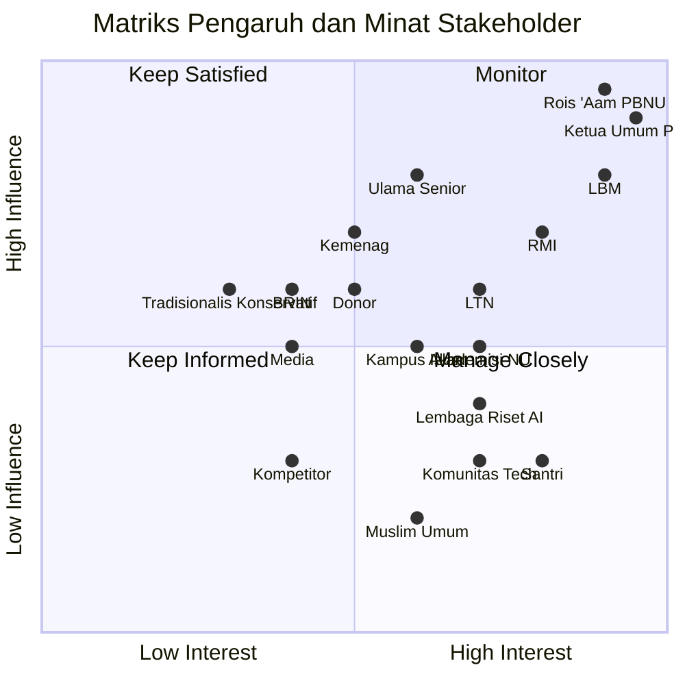

# Matriks Pengaruh & Minat

```mermaid
quadrantChart
    title Matriks Pengaruh dan Minat Stakeholder
    x-axis Low Interest --> High Interest
    y-axis Low Influence --> High Influence
    quadrant-1 Monitor
    quadrant-2 Keep Satisfied
    quadrant-3 Keep Informed
    quadrant-4 Manage Closely
    Rois 'Aam PBNU: [0.9, 0.95]
    Ketua Umum PBNU: [0.95, 0.9]
    LBM: [0.9, 0.8]
    RMI: [0.8, 0.7]
    LTN: [0.7, 0.6]
    Ulama Senior: [0.6, 0.8]
    Santri: [0.8, 0.3]
    Akademisi NU: [0.7, 0.5]
    Kampus Islam: [0.6, 0.5]
    Lembaga Riset AI: [0.7, 0.4]
    Kemenag: [0.5, 0.7]
    BRIN: [0.4, 0.6]
    Muslim Umum: [0.6, 0.2]
    Komunitas Tech: [0.7, 0.3]
    Donor: [0.5, 0.6]
    Media: [0.4, 0.5]
    Tradisionalis Konservatif: [0.3, 0.6]
    Kompetitor: [0.4, 0.3]
```

