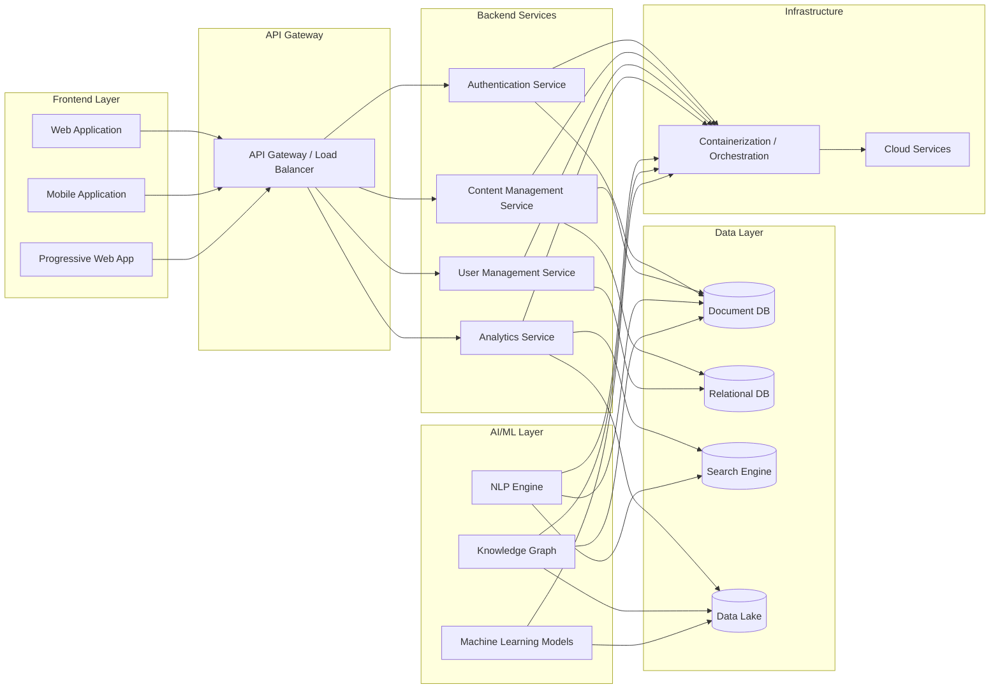

# Arsitektur Sistem

**Arsitektur Sistem**

**1. Pendahuluan**

Dokumen ini menjabarkan arsitektur sistem untuk proyek AI Nahdlatul Ulama, yang bertujuan untuk mengintegrasikan kecerdasan buatan dengan pengetahuan Islam tradisional. Arsitektur ini dirancang untuk mendukung skalabilitas, keamanan, dan fleksibilitas dalam pengembangan dan penggunaan platform.

**2. Gambaran Umum Sistem**

**3. Komponen Utama**

**3.1 Frontend Layer**

* Web Application (React.js)
* Mobile Application (React Native)
* Progressive Web App (PWA)

**3.2 Backend Layer**

* API Gateway (Node.js/Express)
* Microservices (Go, Python)
* Authentication Service (OAuth 2.0, JWT)

**3.3 AI/ML Layer**

* Natural Language Processing Engine (TensorFlow)
* Knowledge Graph (Neo4j)
* Machine Learning Models (PyTorch)

**3.4 Data Layer**

* Document Database (MongoDB)
* Relational Database (PostgreSQL)
* Search Engine (Elasticsearch)
* Data Lake (Apache Hadoop)

**3.5 Infrastructure Layer**

* Containerization (Docker)
* Orchestration (Kubernetes)
* Cloud Services (AWS/GCP)

**4. Integrasi Komponen**

**4.1 API Integration**

* RESTful APIs
* GraphQL for complex queries
* gRPC for internal microservices communication

**4.2 Event-Driven Architecture**

* Message Queue (Apache Kafka)
* Pub/Sub system for real-time updates

**5. Keamanan Sistem**

* Identity and Access Management (IAM)
* Encryption at rest and in transit (AES-256, SSL/TLS)
* Web Application Firewall (WAF)
* Regular security audits and penetration testing

**6. Skalabilitas dan Performa**

* Horizontal scaling untuk microservices
* Caching layer (Redis)
* Content Delivery Network (CDN) untuk aset statis
* Load balancing (NGINX)

**7. Manajemen Data**

* Data versioning
* Backup dan disaster recovery
* Data retention policies
* GDPR dan UU PDP compliance

**8. Monitoring dan Logging**

* Centralized logging (ELK Stack)
* Application Performance Monitoring (New Relic)
* Real-time alerting system
* Dashboard untuk metrik kunci

**9. Deployment dan DevOps**

* CI/CD pipeline (Jenkins, GitLab CI)
* Infrastructure as Code (Terraform)
* Blue-Green deployment strategy
* Automated testing (Unit, Integration, E2E)

**10. Integrasi dengan Sistem Eksternal**

* API untuk integrasi dengan sistem pesantren
* Connector ke database kitab kuning digital
* Integrasi dengan layanan cloud AI (jika diperlukan)

**11. Pertimbangan Khusus**

* Multilingual support (Bahasa Indonesia, Arab, Inggris)
* Offline capabilities untuk penggunaan di daerah dengan konektivitas terbatas
* Aksesibilitas sesuai standar WCAG 2.1

**12. Evolusi Arsitektur**

* Roadmap untuk pengembangan fitur masa depan
* Strategi migrasi untuk upgrade teknologi
* Proses untuk evaluasi dan adopsi teknologi baru

**13. Tantangan dan Mitigasi**

| Tantangan                                     | Strategi Mitigasi                            |
| --------------------------------------------- | -------------------------------------------- |
| Kompleksitas integrasi AI dengan konten Islam | Tim khusus untuk mapping pengetahuan         |
| Skalabilitas untuk jutaan pengguna            | Arsitektur microservices dan auto-scaling    |
| Keamanan data sensitif                        | Enkripsi end-to-end dan akses berbasis peran |
| Akurasi AI dalam konteks Islam                | Validasi berlapis oleh ahli syariah          |

**14. Dokumentasi Teknis**

* API Documentation
* Data Model Diagrams
* Network Architecture Diagrams
* Sequence Diagrams for key processes

**15. Peninjauan dan Pembaruan**

Arsitektur sistem ini akan ditinjau setiap semester atau ketika ada perubahan teknologi signifikan yang dapat meningkatkan kinerja atau fungsionalitas sistem.

***

Disetujui oleh:

\[Tanda tangan]

\[Nama]

Arsitek Teknis AI Nahdlatul Ulama

Tanggal: \[DD/MM/YYYY]
