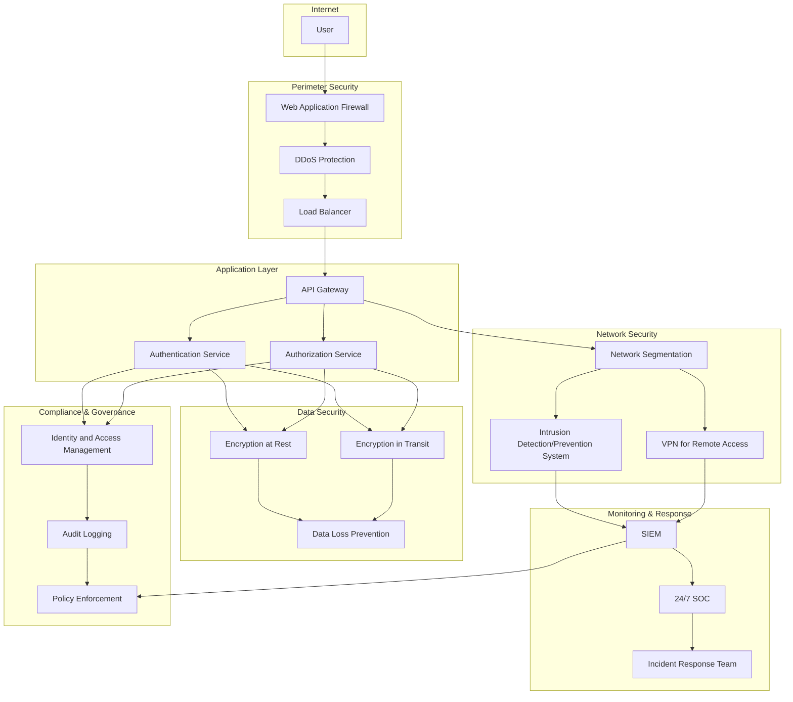

# Rencana Keamanan

**1. Pendahuluan**

Dokumen ini menguraikan strategi dan prosedur keamanan komprehensif untuk proyek AI Nahdlatul Ulama. Tujuannya adalah melindungi integritas, kerahasiaan, dan ketersediaan sistem, data, dan pengguna.

**2. Tujuan Keamanan**

* Melindungi data sensitif pengguna dan konten Islam
* Menjaga integritas sistem AI dan hasil analisanya
* Memastikan ketersediaan layanan 24/7
* Mematuhi standar keamanan industri dan regulasi yang berlaku

**3. Kebijakan Keamanan**

**3.1 Keamanan Informasi**

* Klasifikasi data: Publik, Internal, Rahasia, Sangat Rahasia
* Enkripsi data at-rest dan in-transit
* Kebijakan retensi dan penghapusan data

**3.2 Keamanan Akses**

* Implementasi prinsip least privilege
* Multi-factor authentication (MFA) untuk semua akses
* Single Sign-On (SSO) dengan audit logging

**3.3 Keamanan Jaringan**

* Segmentasi jaringan dengan firewall
* Intrusion Detection/Prevention System (IDS/IPS)
* Virtual Private Network (VPN) untuk akses remote

**3.4 Keamanan Aplikasi**

* Secure Software Development Lifecycle (SSDLC)
* Regular security testing (SAST, DAST, Penetration Testing)
* API security dengan rate limiting dan authentication

**4. Arsitektur Keamanan**

**Keterangan**

* Perimeter Security: WAF, DDoS Protection, dan Load Balancer.
* Application Layer: API Gateway, Authentication, dan Authorization Services.
* Data Security: Enkripsi data at rest dan in transit, serta Data Loss Prevention.
* Network Security: Segmentasi jaringan, IDS/IPS, dan VPN untuk akses remote.
* Monitoring & Response: SIEM, SOC 24/7, dan Tim Respons Insiden.
* Compliance & Governance: IAM, Audit Logging, dan Policy Enforcement.

**5. Manajemen Risiko Keamanan**

**5.1 Identifikasi Risiko**

* Threat modeling untuk setiap komponen sistem
* Vulnerability assessments berkala

**5.2 Mitigasi Risiko**

* Patch management system
* Security awareness training untuk staf
* Incident response plan

**6. Keamanan Operasional**

**6.1 Monitoring dan Logging**

* Security Information and Event Management (SIEM)
* 24/7 Security Operations Center (SOC)
* Log retention policy sesuai regulasi

**6.2 Manajemen Perubahan**

* Change control process dengan approval multi-level
* Rollback plan untuk setiap perubahan

**6.3 Backup dan Recovery**

* Daily incremental dan weekly full backups
* Offsite backup storage
* Regular disaster recovery testing

**7. Keamanan Fisik**

* Access control ke data center
* CCTV monitoring
* Environmental controls (suhu, kelembaban, fire suppression)

**8. Keamanan Sumber Daya Manusia**

* Background checks untuk karyawan dan kontraktor
* NDA untuk semua personel dengan akses ke sistem
* Offboarding process untuk menghapus akses

**9. Keamanan Vendor dan Pihak Ketiga**

* Vendor risk assessment
* Contractual security requirements
* Regular audit terhadap kepatuhan vendor

**10. Compliance dan Audit**

**10.1 Standar Kepatuhan**

* ISO 27001
* GDPR dan UU PDP Indonesia
* PCI DSS (jika aplikabel)

**10.2 Audit**

* Internal security audits kuartalan
* External penetration testing tahunan
* Compliance audits sesuai regulasi

**11. Incident Response Plan**

**11.1 Tahapan Respons**

1. Deteksi dan Analisis
2. Containment
3. Eradication
4. Recovery
5. Post-Incident Review

**11.2 Tim Respons Insiden**

* Incident Response Manager
* Technical Lead
* Legal Counsel
* Communications Officer

**12. Business Continuity dan Disaster Recovery**

* Business Impact Analysis (BIA)
* Recovery Time Objective (RTO) dan Recovery Point Objective (RPO)
* Alternate site untuk operasi darurat

**13. Keamanan AI dan Machine Learning**

* Model security untuk mencegah adversarial attacks
* Data poisoning prevention
* Ethical AI guidelines

**14. Edukasi dan Awareness**

* Mandatory security training untuk semua staf
* Phishing simulation exercises
* Regular security newsletters

**15. Metrik Keamanan**

* Mean Time to Detect (MTTD)
* Mean Time to Respond (MTTR)
* Number of security incidents
* Patch compliance rate

**16. Teknologi Keamanan**

* Next-Generation Firewall (NGFW)
* Endpoint Detection and Response (EDR)
* Data Loss Prevention (DLP)
* Cloud Access Security Broker (CASB)

**17. Peninjauan dan Pembaruan**

Rencana Keamanan ini akan ditinjau setiap kuartal dan diperbarui sesuai dengan perkembangan ancaman keamanan dan teknologi baru.

***

Disetujui oleh:

\[Tanda tangan]

\[Nama]

Chief Information Security Officer (CISO) AI Nahdlatul Ulama

Tanggal: \[DD/MM/YYYY]
