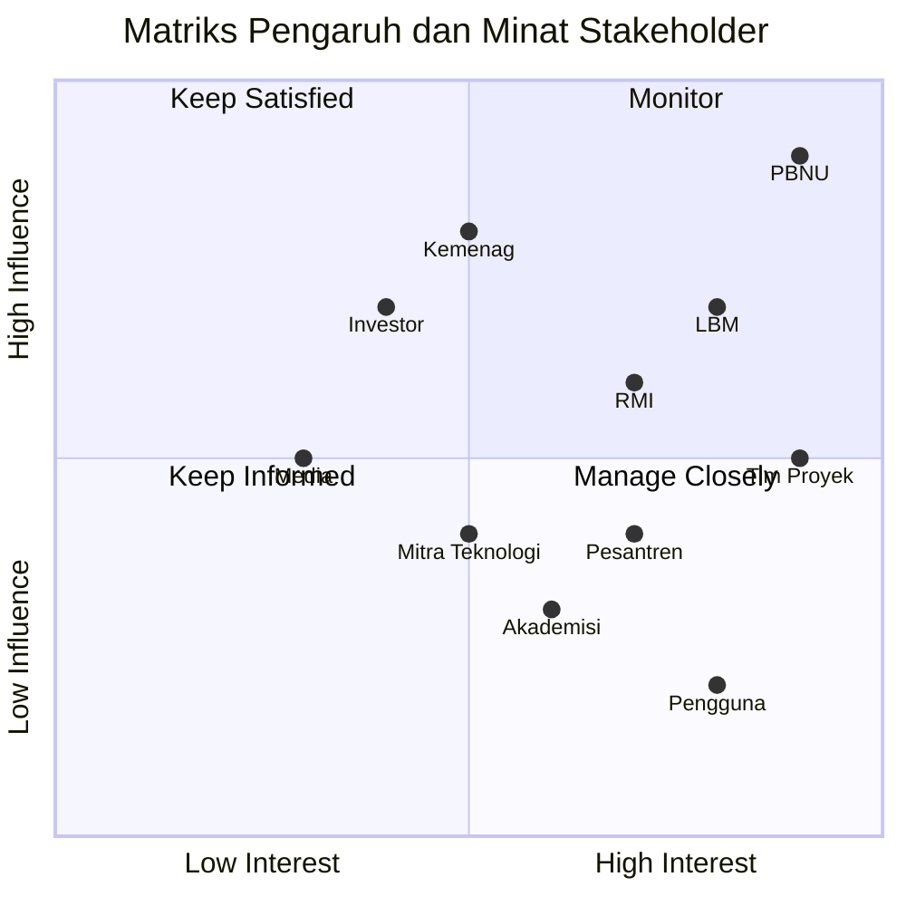
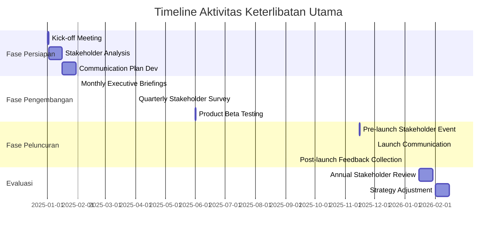

# Rencana Manajemen Pemangku Kepentingan

**1. Pendahuluan**

Dokumen ini menguraikan strategi dan pendekatan untuk mengidentifikasi, menganalisis, dan mengelola keterlibatan pemangku kepentingan dalam proyek AI Nahdlatul Ulama, termasuk pengembangan produk turunannya. Tujuannya adalah memastikan komunikasi efektif dan dukungan berkelanjutan dari semua pihak yang terkait dengan proyek.

**2. Identifikasi Pemangku Kepentingan**

**2.1 Pemangku Kepentingan Internal**

* Pengurus Besar Nahdlatul Ulama (PBNU)
* Tim Proyek AI NU
* Lembaga Bahtsul Masail (LBM)
* Rabithah Ma'ahid Islamiyah (RMI)
* Lajnah Ta'lif wan Nasyr (LTN)
* Tim Pengembangan Produk Turunan

**2.2 Pemangku Kepentingan Eksternal**

* Kementerian Agama RI
* Komunitas pesantren
* Akademisi dan peneliti Islam
* Mitra teknologi
* Pengguna produk (ulama, santri, masyarakat umum)
* Investor dan donor
* Media dan masyarakat umum

**3. Analisis Pemangku Kepentingan**

**4. Strategi Keterlibatan**

| Kategori       | Strategi                                                               |
| -------------- | ---------------------------------------------------------------------- |
| Manage Closely | Komunikasi intensif, keterlibatan langsung dalam pengambilan keputusan |
| Keep Satisfied | Update reguler, konsultasi pada keputusan besar                        |
| Keep Informed  | Komunikasi rutin, mekanisme feedback                                   |
| Monitor        | Pantau kebutuhan informasi, update seperlunya                          |

**5. Metode Komunikasi**

* Pertemuan tatap muka dan virtual
* Webinar dan seminar online
* Newsletter bulanan
* Platform kolaborasi digital
* Media sosial resmi NU
* Laporan progress berkala
* Forum diskusi produk

**6. Rencana Keterlibatan Spesifik**

**6.1 PBNU**

* Briefing eksekutif bulanan
* Persetujuan milestone utama
* Partisipasi dalam launch events produk turunan

**6.2 Lembaga Bahtsul Masail**

* Workshop validasi konten mingguan
* Akses prioritas ke prototype sistem
* Sesi feedback pasca-implementasi fitur AI

**6.3 Komunitas Pesantren**

* Program sosialisasi berkeliling
* Pelatihan penggunaan sistem AI dan produk turunan
* Forum diskusi online untuk feedback berkelanjutan

**6.4 Mitra Teknologi**

* Pertemuan koordinasi teknis bulanan
* Hackathon kolaboratif tahunan
* Sharing knowledge sessions tentang perkembangan AI

**6.5 Pengguna Produk**

* Beta testing program untuk produk turunan
* Survei kepuasan pengguna kuartalan
* Komunitas pengguna online untuk setiap produk

**6.6 Investor dan Donor**

* Laporan kinerja finansial kuartalan
* Showcase produk turunan tahunan
* Pertemuan strategi pengembangan bisnis

**7. Manajemen Ekspektasi**

* Dokumentasi dan komunikasi ruang lingkup proyek yang jelas
* Pengelolaan perubahan yang transparan
* Mekanisme feedback dan penanganan keluhan untuk setiap produk
* Komunikasi reguler tentang pencapaian dan tantangan proyek

**8. Pengelolaan Konflik**

* Prosedur eskalasi bertingkat untuk isu stakeholder
* Mediasi oleh pihak netral jika diperlukan
* Dokumentasi resolusi konflik untuk pembelajaran
* Pelatihan manajemen konflik untuk tim proyek

**9. Pengukuran Efektivitas Keterlibatan**

* Survei kepuasan stakeholder kuartalan
* Tingkat partisipasi dalam acara proyek dan produk
* Analisis sentimen media sosial dan forum pengguna
* Net Promoter Score (NPS) untuk produk turunan
* Jumlah dan kualitas feedback yang diterima

**10. Peran dan Tanggung Jawab**

* Stakeholder Engagement Manager: Mengawasi seluruh proses keterlibatan
* Tim Komunikasi: Mengelola saluran komunikasi dan konten
* Product Managers: Mengelola keterlibatan stakeholder spesifik produk
* Direktur Proyek: Keterlibatan dengan stakeholder level eksekutif

**11. Sumber Daya**

* Tim dedicated untuk stakeholder engagement
* Budget untuk acara dan material komunikasi
* Tools manajemen stakeholder (e.g., CRM system)
* Platform analisis feedback dan sentimen

**12. Timeline Keterlibatan Utama**

**13. Manajemen Risiko Stakeholder**

| Risiko                                | Probabilitas | Dampak | Mitigasi                                   |
| ------------------------------------- | ------------ | ------ | ------------------------------------------ |
| Resistensi terhadap teknologi AI      | Tinggi       | Tinggi | Program edukasi, demonstrasi manfaat       |
| Konflik kepentingan antar stakeholder | Sedang       | Tinggi | Mediasi aktif, komunikasi transparan       |
| Ekspektasi yang tidak realistis       | Tinggi       | Sedang | Manajemen ekspektasi proaktif              |
| Ketidakpuasan dengan produk turunan   | Sedang       | Tinggi | Iterasi cepat, responsif terhadap feedback |

**14. Strategi Keterlibatan untuk Produk Turunan**

| Produk                         | Stakeholder Utama                   | Strategi Keterlibatan                        |
| ------------------------------ | ----------------------------------- | -------------------------------------------- |
| Langganan Premium              | Pengguna individual, Lembaga Islam  | User testing groups, Webinar fitur eksklusif |
| Islamic Education Platform     | Pesantren, Akademisi                | Pilot program, Co-creation workshops         |
| NU Digital Library             | Peneliti, Mahasiswa                 | Research partnership, Akses beta             |
| Halal Product Verification API | Industri makanan, Badan sertifikasi | Integrasi pilot, Roundtable diskusi          |
| Islamic Finance Advisory Tool  | Lembaga keuangan syariah, Investor  | Demo eksklusif, Advisory board               |

**15. Peninjauan dan Pembaruan**

Rencana Manajemen Pemangku Kepentingan ini akan ditinjau setiap kuartal dan diperbarui sesuai dengan dinamika proyek, feedback stakeholder, dan perkembangan produk turunan.

***

Disetujui oleh:

\[Tanda tangan]

\[Nama]

Stakeholder Engagement Manager AI Nahdlatul Ulama

Tanggal: \[DD/MM/YYYY]
