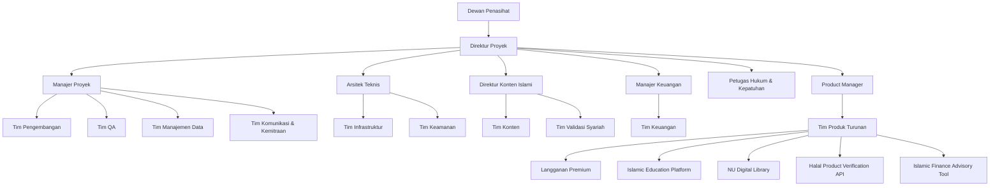

# Rencana Manajemen Sumber Daya

**Rencana Manajemen Sumber Daya**

**1. Pendahuluan**

Dokumen ini menguraikan strategi dan proses untuk mengidentifikasi, memperoleh, dan mengelola sumber daya yang diperlukan untuk keberhasilan proyek AI Nahdlatul Ulama, termasuk pengembangan produk turunannya.

**2. Struktur Tim Proyek**

**2.1 Hirarki Organisasi**

**2.2 Peran dan Tanggung Jawab Utama**

* Direktur Proyek: Memimpin visi dan strategi keseluruhan proyek
* Manajer Proyek: Mengelola operasional harian dan koordinasi tim
* Arsitek Teknis: Merancang arsitektur sistem dan memimpin keputusan teknologi
* Kepala Tim Pengembangan: Mengawasi proses pengembangan software
* Direktur Konten Islami: Memastikan akurasi dan kesesuaian konten Islam
* Manajer QA: Mengawasi proses jaminan kualitas
* Manajer Keuangan: Mengelola aspek finansial proyek
* Product Manager: Mengelola pengembangan dan strategi produk turunan

**3. Akuisisi Sumber Daya**

**3.1 Strategi Perekrutan**

* Internal: Memanfaatkan jaringan PBNU untuk posisi kunci
* Eksternal: Menggunakan agen perekrutan, job boards, dan kemitraan kampus
* Kolaborasi: Bermitra dengan startup Islam untuk talent produk turunan

**3.2 Jadwal Perekrutan**

| Fase              | Periode    | Fokus Perekrutan                    |
| ----------------- | ---------- | ----------------------------------- |
| Inisiasi          | Bulan 1-2  | Tim inti dan kepemimpinan           |
| Pengembangan Awal | Bulan 3-6  | Tim teknis dan konten               |
| Ekspansi          | Bulan 7-12 | Tim produk turunan dan spesialis    |
| Scaling           | Bulan 13+  | Penguatan tim berdasarkan kebutuhan |

**4. Pengembangan Tim**

* Program onboarding komprehensif untuk semua anggota baru
* Pelatihan teknis dan syariah berkala
* Program mentoring untuk pengembangan karir
* Aktivitas team building untuk meningkatkan kohesi
* Pelatihan khusus untuk tim pengembangan produk turunan

**5. Manajemen Kinerja**

* Penetapan Key Performance Indicators (KPI) individual dan tim
* Evaluasi kinerja kuartalan dengan feedback konstruktif
* Sistem reward dan recognition untuk pencapaian luar biasa
* Proses feedback 360 derajat untuk penilaian komprehensif
* Metrik khusus untuk mengukur kinerja tim produk turunan

**6. Alokasi Sumber Daya**

* Penggunaan Microsoft Project untuk resource leveling
* Implementasi matriks RACI untuk setiap work package
* Prosedur eskalasi yang jelas untuk menangani konflik sumber daya
* Alokasi fleksibel sumber daya antara proyek utama dan produk turunan

**7. Manajemen Pengetahuan**

* Implementasi wiki proyek internal untuk dokumentasi
* Sesi knowledge sharing mingguan untuk berbagi expertise
* Dokumentasi best practices dan lessons learned secara sistematis
* Pengembangan repository pengetahuan khusus untuk produk turunan

**8. Kesehatan dan Keselamatan Kerja**

* Kebijakan work-life balance untuk mencegah burnout
* Program kesehatan mental dan konseling
* Pedoman ergonomic workspace untuk kenyamanan kerja
* Penyediaan asuransi kesehatan komprehensif untuk seluruh tim

**9. Penutupan Proyek**

* Rencana transisi personel pasca-proyek
* Pelaksanaan exit interviews untuk umpan balik
* Pemberian penghargaan atas kontribusi tim
* Perencanaan karir dan penempatan untuk fase selanjutnya

**10. Manajemen Sumber Daya untuk Produk Turunan**

**10.1 Struktur Tim Produk Turunan**

| Produk                         | Peran Kunci                                                   |
| ------------------------------ | ------------------------------------------------------------- |
| Langganan Premium              | Product Owner, UX Designer, Backend Developer                 |
| Islamic Education Platform     | Instructional Designer, Content Creator, Full-stack Developer |
| NU Digital Library             | Data Scientist, UI Developer, Content Curator                 |
| Halal Product Verification API | API Developer, Database Administrator, Syariah Consultant     |
| Islamic Finance Advisory Tool  | Financial Analyst, AI Engineer, Syariah Finance Expert        |

**10.2 Strategi Alokasi Sumber Daya**

* Pembentukan tim lintas fungsi untuk meningkatkan efisiensi
* Implementasi rotasi personel untuk berbagi pengetahuan
* Pemanfaatan outsourcing untuk keahlian spesifik jangka pendek

**11. Anggaran Sumber Daya**

| Kategori                   | Alokasi Anggaran (%) |
| -------------------------- | -------------------- |
| Gaji dan Tunjangan         | 70%                  |
| Pelatihan dan Pengembangan | 10%                  |
| Rekrutmen                  | 5%                   |
| Teknologi dan Tools        | 10%                  |
| Lain-lain                  | 5%                   |

**12. Manajemen Risiko Sumber Daya**

| Risiko                    | Strategi Mitigasi                                                 |
| ------------------------- | ----------------------------------------------------------------- |
| Kekurangan talent AI      | Pengembangan program magang dan kerjasama dengan universitas      |
| Burnout tim               | Implementasi rotasi tugas dan kebijakan cuti wajib                |
| Konflik internal          | Penerapan program mediasi dan peningkatan aktivitas team building |
| Kehilangan personel kunci | Penguatan dokumentasi pengetahuan dan perencanaan suksesi         |

**13. Peninjauan dan Pembaruan**

Rencana Manajemen Sumber Daya ini akan ditinjau setiap kuartal atau ketika ada perubahan signifikan dalam kebutuhan proyek, termasuk perkembangan produk turunan. Pembaruan akan didokumentasikan dan dikomunikasikan kepada semua stakeholder terkait.

***

Disetujui oleh:

\[Tanda tangan]

\[Nama]

Direktur Proyek AI Nahdlatul Ulama

Tanggal: \[DD/MM/YYYY]
